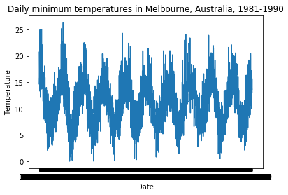
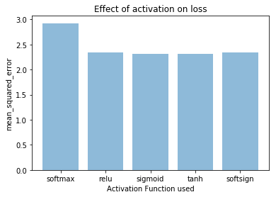

# Episode 1

Dataset: Minimum daily temperature over ten years (1981-1990) in Melbourne, Austrailia  
No. of rows: 3650  
Variables: Date, Temperature  
Example:  
|  Date     | Temp |  
|1981-01-01 | 20.7|  
|1981-01-02 | 17.9|  
|1981-01-03	| 18.8|  

## Hyperparameters for LSTM
Using Long-Short term memory (LSTM) model to forecast every 6th temperature reading. Current window_size = 5. Can be changed to other values.  
+ state_variable_length = 10 *(try 10, 50, 100)*
+ activation = ['softmax', 'relu', 'sigmoid', 'tanh', 'softsign']
+ optimizer = 'adam' *(try out SGD, RMSprop, adam , Adagrad, Adamax)*
+ loss = 'mean_squared_error' *(try mean_squared_error, mean_absolute_error, mean_absolute_percentage_error, + mean_squared_logarithmic_error)*
+ epochs = 100 *(try 10, 100, 500, 1000)*
+ batch_size = 32 *(try 32, 64, 128)*

## Usage
Simply run cells 9-11 in the python notebook.

## Results:

