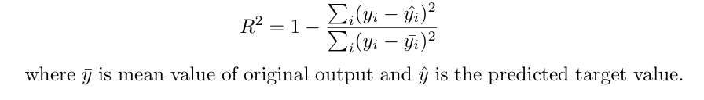
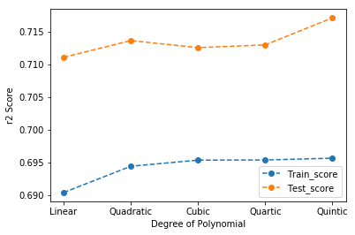

# Episode 2: Example of Polynomial Regression using different degrees to estimate C02 emissions from engine size. Use R2 score to compare the models.

Dataset [1]: Contains model-specific fuel consumption ratings and estimated carbon dioxide emissions for new light-duty vehicles for retail sale in Canada. 
No. of rows: 1067  
Variables (12): 
- **MODELYEAR** e.g. 2014
- **MAKE** e.g. Acura
- **MODEL** e.g. ILX
- **VEHICLE CLASS** e.g. SUV
- **ENGINE SIZE** e.g. 4.7
- **CYLINDERS** e.g 6
- **TRANSMISSION** e.g. A6
- **FUELTYPE**
- **FUEL CONSUMPTION in CITY(L/100 km)** e.g. 9.9
- **FUEL CONSUMPTION in HWY (L/100 km)** e.g. 8.9
- **FUEL CONSUMPTION COMB (L/100 km)** e.g. 9.2
- **FUELCONSUMPTION_COMB_MPG**
- **CO2 EMISSIONS (g/km)** e.g. 182   --> low --> 0

## Models:
 - Linear Regression (n = 1)
 - Quadratic Regression (n = 2)
 - Cubic Regression (n = 3)
 - Quartic Regression (n = 4)
 - Quintic Regression (n = 5)

## Metric:
 - R2 Score: In regression, the R2 coefficient of determination is a statistical measure of how well the regression predictions approximate the real data points. An R2 of 1 indicates that the regression predictions perfectly fit the data. [2]  
 

## Results:

## References:
[1] [Fuel consumption ratings - Government of Canada] (https://open.canada.ca/data/en/dataset/98f1a129-f628-4ce4-b24d-6f16bf24dd64)  
[2] [Coefficient of determination - Wikipedia] (https://en.wikipedia.org/wiki/Coefficient_of_determination)
